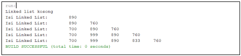

## **
Jobsheet 9 (Linked List)
**

>
Nama : Bagus Dwi Putranto

>Kelas : 1F D4 TI

>Nomer Absen : 08

>NIM : 2141720079

 

### 1. Tujuan Praktikum
Setelah melakukan materi praktikum ini, mahasiswa mampu:
- Membuat struktur data linked list
- Membuat linked list pada program
- Membedakan permasalahan apa yang dapat diselesaikan menggunakan linked list

### 2. Praktikum

### 2.1 Pembuatan Single Linked List
Waktu percobaan : 30 menit
Didalam praktikum ini, kita akan mempraktekkan bagaimana membuat Single Linked List dengan 
representasi data berupa Node, pengaksesan linked list dan metode penambahan data.

1. Pada Project StrukturData yang sudah dibuat pada Minggu sebelumnya, buat package dengan 
nama minggu11

2. Tambahkan class-class berikut:

3. Implementasi class Node

4. Tambahkan atribut pada class SingleLinkedList

5. Sebagai langkah berikutnya, akan diimplementasikan method-method yang terdapat pada 
SingleLinkedList.

6. Tambahkan method isEmpty().

7. Implementasi method untuk mencetak dengan menggunakan proses traverse.

8. Implementasikan method addFirst().

9. Implementasikan method addLast().

10. Implementasikan method insertAfter, untuk memasukkan node yang memiliki data 
input setelah node yang memiliki data key.

11. Tambahkan method penambahan node pada indeks tertentu.

12. Pada class SLLMain, buatlah fungsi main, kemudian buat object dari class SingleLinkedList.

13. Tambahkan Method penambahan data dan pencetakan data di setiap penambahannya agar 
terlihat perubahannya.

### 2.1.1 Verifikasi Hasil Percobaan
Cocokkan hasil compile kode program anda dengan gambar berikut ini.

### 2.1.2 Pertanyaan

1. Mengapa hasil compile kode program di baris pertama menghasilkan “Linked List Kosong”?
>jawab : **Karena belum mengisikan data, atau bisa dibilang method print saat masuk ke pemilihan masuk ke pilihan if(isEmpty()).**

2. Pada step 10, jelaskan kegunaan kode berikut

>jawab : **jika data yang sudah ada pada linked list sama dengan variabel key, maka data yang kita isi = data linked list berikutnya.**

3. Perhatikan class SingleLinkedList, pada method insertAt Jelaskan kegunaan kode berikut

>jawab : **Jika data setelah dan setelahnya lagi adalah kosong, maka variable tail = data berikutnya, atau bisa dibilang kita dalam kondisi menginputkan data sebelum indeks terkahir (tail).**

### 2.2 Modifikasi Elemen pada Single Linked List
Waktu percobaan : 30 menit
Didalam praktikum ini, kita akan mempraktekkan bagaimana mengakses elemen, mendapatkan 
indeks dan melakukan penghapusan data pada Single Linked List.: 

### 2.2.1 Langkah-langkah Percobaan

1. Implementasikan method untuk mengakses data dan indeks pada linked list

2. Tambahkan method untuk mendapatkan data pada indeks tertentu pada class Single Linked List

3. Implementasikan method indexOf.

4. Tambahkan method removeFirst pada class SingleLinkedList

5. Tambahkan method untuk menghapus data pada bagian belakang pada class 
SingleLinkedList

6. Sebagai langkah berikutnya, akan diimplementasikan method remove

7. Implementasi method untuk menghapus node dengan menggunakan index.

8. Kemudian, coba lakukan pengaksesan dan penghapusan data di method main pada class 
SLLMain dengan menambahkan kode berikut

9. Method SLLMain menjadi:

10. Jalankan class SLLMain

### 2.2.2 Verifikasi Hasil Percobaan
Cocokkan hasil compile kode program anda dengan gambar berikut ini.

### 2.2.3 Pertanyaan

1. Mengapa digunakan keyword break pada fungsi remove? Jelaskan!
>jawab : **untuk menghentikan operasi program**

2. Jelaskan kegunaan kode dibawah pada method remove

>jawab : **jika data setelah (temp.next.data) sama dengan variable key, maka data setelah sama dengan data setelah setlahnya, atau bisa dibilang  data setelah diganti dengan data setelah setelah lagi (menghilangkan data setelah dengan data setelah setelahnya lagi).**

3. Apa saja nilai kembalian yang dapat dikembalikan pada method indexOf? Jelaskan maksud masing-masing kembalian tersebut!
>jawab : **deklarasi variable index bertipe interger dengan nilai 0, ketika alamat tidak kosong dan data tidak sama dengan variable key maka alamat menajadi alamat selanjutnya (lanjut ke data berikutnya) dan increment variable index, kemudian jika alamat adalah kosong maka menjadi -1, selain itu kembalikan nilai index**

### 3. Tugas
Waktu pengerjaan : 50 menit

1. Buat method insertBefore untuk menambahkan node sebelum keyword yang diinginkan

2. Implementasikan ilustrasi Linked List Berikut. Gunakan 4 macam penambahan data yang telah dipelajari sebelumnya untuk menginputkan data.

>Node 2 source code :

>SingleLinkedList2 source code :

>Main code dari tugas 2 :

>Output tugas 2 :

3. Buatlah Implementasi Stack berikut menggunakan Single Linked List

>Node 2 source code :

>SingleLinkedList2 source code :

>Main code dari tugas 3 :

>Output tugas 3 :

4. Buatlah implementasi program antrian untuk mengilustasikan mahasiswa yang sedang meminta 
tanda tangan KRS pada dosen DPA di kampus pada tugas jobsheet 8 menggunakan LinkedList.
Implementasikan Queue pada antrian mahasiswa dengan menggunakan konsep LinkedList!

>Node 2 source code :

>SingleLinkedList2 source code :

>Ada penambahan method pada SingleLinkedList2, yaitu method indexOf2

>Main code dari tugas 4 :

>Output tugas 4 :

